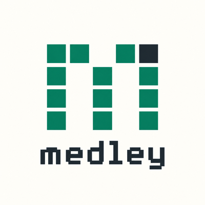

<p align="center">
  
</p>

<p align="center">
  A text-mode web browser for humans and agents.<br>
  <a href="https://nam37.github.io/medley/">nam37.github.io/medley</a>
</p>

Pages come back as compact text with every interactive element numbered. You
act on elements by number, and each action prints only what changed. People can
browse in a full-screen terminal UI, agents through MCP or the CLI, and both can
share one session: you can watch an agent browse and take over at any point.

```
$ medley goto nam37.github.io/medley/demo/
Fernway Outfitters
https://nam37.github.io/medley/demo/ · 19 refs · viewport 0–900 of 1671px

── header ──
[1]Fernway

── nav "Main" ──
[2]Gear  [3]Trails  [4 button "Menu" collapsed]
…
$ medley click 4
clicked [4 button "Menu"] · +2 -1 lines
@@ nav "Main" @@
  ── nav "Main" ──
- [2]Gear  [3]Trails  [4 button "Menu" collapsed]
+ [2]Gear  [3]Trails  [4 button "Menu" expanded]
+ [20]Account  [21]Orders
```

## Install

You need [Bun](https://bun.sh) 1.3 or later, and Chrome or Edge (medley finds
them, or set `MEDLEY_BROWSER` to the browser's path). It drives the browser
over the DevTools protocol; the only package it depends on is
[OpenTUI](https://opentui.com), for the terminal UI.

```bash
git clone https://github.com/nam37/medley.git
cd medley
bun install
bun src/cli.ts tui en.wikipedia.org
```

The examples below write `medley` for `bun src/cli.ts`. To type it that way,
add an alias, such as `alias medley="bun /path/to/medley/src/cli.ts"` in bash
or zsh, or `function medley { bun C:\path\to\medley\src\cli.ts @args }` in
PowerShell.

A command takes as long as the page does to load and settle, plus Bun's own
start (a few hundred milliseconds). The first command also starts the browser,
which takes a second or two; the terminal UI starts it while you type the first
address. If Bun came from npm, its launcher adds to every start; Bun's own
installer ([bun.sh](https://bun.sh)) doesn't have one.

## Terminal UI

```
medley tui [url]
```

```
 medley  Medley test app  file:///home/you/medley/test/app.html                12 refs · all
  ── header › nav "Main" ──
▎ [1]Fixture page  [2]Fixture in a new tab  [3 button "Menu" expanded]
▎ - [11]Settings
▎ - [12]Log out
  ── main ──
  # Todos
  [4 textbox "New todo"] [5 button "Add"]
 clicked [3 button "Menu"] · +3 -1 lines          agent: typed into [4 textbox "New todo"] ●
 Tab select · Enter open · o address · ← back · / find · : command · ? keys · q quit
```

It shows the session's current page, or opens `url`; until there's a page, medley's
logo stands in for it, a light running along the "m". Refs are colored and
link text is underlined. Lines that changed with the last action are marked in
the left gutter. The status line shows the result of your last action on the
left and, in purple, whatever another client (an agent) just did; the page
refreshes by itself when that happens, and also when the page loads a new one
on its own, such as the real site after a "checking your browser" page. `●`
means it's following the session live. While a command runs, a light band
sweeps across the `medley` badge and the status line says what's happening.

| Keys | |
|---|---|
| Tab, Shift+Tab | select the next or previous ref; the status line shows where a link goes |
| t | open the selected link in a new tab |
| T, or a click on "tab 2/3" | the open tabs: type a number, then Enter switches to it (or d closes it) |
| l, or a click on "N refs" | pull down a list of the page's refs, with where each link goes: type to filter, ↑ ↓ to choose, Enter (or a click) opens |
| Enter, or a mouse click | open the ref: links and buttons are clicked; text fields, selects and file fields ask for input |
| 0-9, then Enter | open a ref by its number |
| h | hover over the selected ref (menus that open on hover) |
| [ ] | previous or next tab; the top bar shows `tab 2/3` when there's more than one |
| ↑ ↓ j k, Space PgDn PgUp, Home End | scroll; scrolling past the end scrolls the browser too, loading lazy content |
| o, Ctrl+L | open an address, or type words to search for them |
| a | bookmark this page |
| B | bookmarks and this tab's history: type a line's number, then Enter opens it (or d deletes a bookmark) |
| ← b, → f | back, forward |
| / then n N | find text, next or previous match |
| : | run any session command, e.g. `press Escape`, `wait 2`, `select 6 High` |
| v | cycle the grid: no grid → partial grid (the page's main columns, like a sidebar beside the content) → advanced grid (the page as laid out, with its colors and pictures) |
| i | the page's pictures one at a time, as big as the view fits them, starting from the first in view: ← → step, Esc closes |
| m | reader mode: articles show only their main text, without the site's menus, sidebars and footers; it stays on from page to page until m again |
| =, or a click on the title or address | page info, as a browser's padlock menu shows it: the connection and certificate, cookies and site data (c, then y, clears this site's), what the page says about itself, and what loading it took |
| \ | the page's source, as the server sent it (with find); \ again brings the page back |
| r, R | reload the page, like a browser's refresh (R bypasses the cache) |
| w | wait 2 seconds and show what the page changed by itself |
| y n | accept or dismiss a `confirm()` the page opened (a `prompt()` asks for its answer) |
| ? | show all keys |
| q | quit: asks "Quit medley?", then "Close the background browser session?" (n keeps it running for other clients) |
| Q, Ctrl+C | quit at once, keeping the session running |

In a field prompt, Enter types and submits (like pressing Enter in the field),
Tab types without submitting, and Esc cancels. A password field's prompt shows
a dot for each character and never the text itself; it starts empty.

The grid modes only change how the page is drawn; the text, refs and keys stay
the same.

- **Partial grid** turns groups of side-by-side blocks into columns, with widths
  in proportion to the page. It only does so when every column gets at least 20
  characters; otherwise the group stays linear, so on a narrow terminal it falls
  back to the plain view.
- **Advanced grid** draws the page itself, scaled to the terminal. Each block's
  text goes where the block was, in the page's own text colors, over its
  background colors and card borders. Pictures (``, `<video>`, `<canvas>`,
  and CSS background pictures and gradients) come from a screenshot, which the
  UI fetches again whenever the page's pictures change or the page grows, and
  are drawn the best way the terminal can: Kitty graphics (Kitty, WezTerm, Ghostty), Sixel
  (Windows Terminal and others), or else block characters, which work in any
  terminal. OpenTUI picks; `OPENTUI_IMAGE_PROTOCOL=blocks|sixel|kitty`
  overrides it. When text needs more rows than its box had on the page,
  everything below moves down together, so blocks that lined up on the page
  still line up. Things that were off the page to the side or above it, such
  as a carousel's hidden slides or a hidden "skip to content" link, aren't
  drawn, as on the page. A dialog floating over the page (a
  modal, a consent notice) is drawn as a bordered card where it floated,
  hiding what it covers, as on the page. The `#` and `──` markup of the text
  format is left out, and tables are drawn as ruled grids with a bold header
  row. A grid grows wider than the table was on the page when its text needs
  the room, but only into free space; otherwise its cells wrap.

## Commands

```
medley goto <url>                   open a page (starts the session if needed)
medley search <words>               search the web and open the results
medley snapshot [--diff] [--links]  print the current page, or only what changed since you last looked
medley snapshot --outline           the page's regions and headings, with how many lines and refs each holds
medley snapshot --section <name>     one region or heading and what's under it
medley snapshot --reader             reader view: only the page's main text (goto <url> --reader too)
medley click <ref>
medley type <ref> <text> [--submit] replace a field's text, optionally pressing Enter
medley fill <ref>=<value>... [--submit]  fill fields at once: text, a select's option, a checkbox on/off, a slider's number
medley select <ref> <option>        choose a <select> option by text or value
medley press <key>                  Enter, Escape, Tab, ArrowDown, PageDown, a, Control+a, …
medley hover <ref>                  move the mouse over an element (menus that open on hover)
medley drag <ref> <ref|text>        drag an element onto another, or onto a drop zone's text
medley scroll [down|up|top|bottom|<ref>]
medley upload <ref> <file>...        choose files for a file field, as if picked in its dialog
medley reload [--hard]              reload the page (--hard: bypass the cache)
medley back | forward
medley history [n]                  list this tab's pages, or go to the n-th
medley downloads                    list what this session downloaded, and where
medley tabs                         list open tabs
medley newtab [url]                 open a new tab, blank or on a page, and switch to it
medley click <ref> --new-tab        open a link in a new tab, keeping this page
medley tab <number>                 switch to a tab
medley close-tab [number]           close a tab (the current one by default)
medley wait [seconds]               let the page work, then show what changed
medley wait --for <text> [seconds]  wait until the text (or the page title) shows, then show what changed
medley wait --gone <text> [seconds] wait until it doesn't (a "Loading…" going away)
medley screenshot [file] [--full]   save a PNG of the window, or of the whole page
medley info [--json]                page info: connection and certificate, cookies and site data, about the page, loading
medley clear-site-data              delete the page's site's cookies and stored data (signs you out there)
medley source [--dom]               the page's HTML as the server sent it (--dom: as it is now)
medley dialog accept [text] | dismiss
medley status | stop

medley tui [url]                    the terminal UI, sharing the session
medley snapshot <url> [--json]      one-off: fresh browser, print the page (or its raw model), exit
medley mcp                          MCP server on stdio, sharing the session
```

A long page can be read in parts: `goto <url> --outline` (or `search … --outline`)
returns the new page's outline instead of all of it, and `snapshot --section
History` returns one part, with refs that work as usual. On a Wikipedia article
the outline is 1.5 KB where the page is 22 KB. MCP takes `outline` and
`section` the same way.

An article can be read without the site around it: `goto <url> --reader` or
`snapshot --reader` (MCP `reader`, the terminal UI's `m`) returns only the
page's main text, with its refs: the headline, byline and body, without the
menus, sidebars, footers and teasers. Medley finds it much as Firefox's Reader
View does, by where the page's running text is, and says so when a page (a
home page, a search) has no main text to single out. A BBC News article is 34
of its 93 lines.

Options: `--session <name>` for parallel sessions, `--headed` to watch the
browser window, `--no-color`, `--width <px>`, `--browser <path>`, and two that
apply when a session starts:

- `--profile <name>` keeps the browser profile in `~/.medley/profiles/<name>`,
  so cookies, logins and site storage last from one session to the next (or
  set `MEDLEY_PROFILE`). Without it, each session starts with a fresh profile
  that's deleted when it stops. One session at a time can use a profile.
- `--downloads <dir>` is where downloads go (default `~/Downloads/medley`).
  A click or a `goto` that downloads a file waits for it (up to 30 seconds)
  and ends with a note saying where it was saved; `downloads` lists them all.
  A file never overwrites another: the second `report.csv` is `report (2).csv`.

Searches (`search`, MCP `browser_search`, or words typed in the terminal UI's
address prompt) go to Bing, which answers headless browsers; set
`MEDLEY_SEARCH` to another engine's URL with `%s` where the words go.
Bookmarks are kept in `~/.medley/bookmarks.json` (or `MEDLEY_BOOKMARKS`),
shared by every session.

If a session was started by an older copy of medley, commands it doesn't know
fail with a hint to restart it (`medley stop`), and the terminal UI says so
when it attaches.

### Use it from an agent

```
claude mcp add medley -- bun /path/to/medley/src/cli.ts mcp
```

The MCP tools (`browser_goto`, `browser_click`, `browser_type`, …) talk to the
same session as the CLI and the terminal UI. Run `medley tui` while an agent
browses to watch it live, or `medley snapshot` to take a single look. An agent
with a shell can also just call the CLI.

A few of them save an agent round trips: `browser_fill` fills a whole form and
reports once, `browser_wait` with `text` waits for something to show up (or go
away, with `gone`) instead of guessing how long, `browser_snapshot` with
`outline` or `section` reads a long page in parts, and `browser_screenshot`
returns an image of the page for what text can't show. `browser_page_info`
answers the questions a browser's padlock menu does (is the connection secure,
whose certificate, which sites' cookies the page uses, how many other sites it
contacted), and `browser_source` returns the HTML, for meta tags and
structured data the text leaves out.

`info` reads like this (for The Verge):

```
Connection
  Secure: TLS 1.3 (X25519MLKEM768, AES_128_GCM) over HTTP/2 from 151.101.65.91:443
  Certificate for *.theverge.com (and 22 other names), issued by GlobalSign Atlas R3 DV TLS CA 2026 Q2, valid Jun 26, 2026 to Jan 11, 2027
Cookies and site data
  38 cookies from theverge.com; 79 from 24 other sites: sonobi.com 20, pubmatic.com 11, twitter.com 5, rubiconproject.com 5, smartadserver.com 3 and 19 more
  351 kB stored: indexeddb 351 kB, service workers 720 bytes
About this page
  The Verge
  https://www.theverge.com/
  "The Verge is about technology and how it makes us feel. …"
  American English
  3,656 words, about 16 minutes to read
  504 links · 10 fields in 1 form · 115 pictures · 18 frames
Loading
  200 OK, text/html · parsed in 1.8 s · still loading after 8.6 s
  351 requests to 96 hosts (65 other sites) · at least 4.2 MB transferred
  Other sites it asked: adsafeprotected.com, ad-delivery.net, cookielaw.org, doubleclick.net, google.com, … and 57 more
```

## Output format

| Syntax | Meaning |
|---|---|
| `[7]text` | link (ref 7); state in parens, e.g. `(current)`, `(expanded)` |
| `[8 kind "name" = "value" states]` | other controls: button, textbox, password, combobox, select, checkbox, radio, slider, tab, menuitem, option, file, draggable (a password's value shows as `********`; a file field's, as the chosen files' names) |
| `[9 clickable …]` | outermost pointer-cursor element that isn't a real control (script-driven click target) |
| `── nav "Primary" ──` | landmark: header, nav, main, aside, footer, search, form, dialog; `header › nav` when nested |
| `#`, `-`, `1.`, `\|` tables, fences, `>` | headings, lists, data tables, `<pre>`, blockquotes |
| `[img "alt"]`, `[iframe "title"]`, `[video]` | non-text content (unlabelled images are dropped; an iframe shows as a placeholder only when its content can't be read) |
| `── iframe "Checkout" ──` | the content of an embedded frame from another site, read in where the frame is; its refs work like any other |

Blocks that sit side by side on the page share a line. Hidden content is
dropped, label text is folded into its control's name, and passwords are masked.
An open modal (a cookie or terms notice, a sign-up box) usually comes last, as
`── dialog "…" ──`, since pages put it at the end. Clicking something it covers
fails with the modal's buttons, e.g. `ref 17 is covered by a dialog "Legal Terms
and Privacy"; close it first: [323 button "Agree"]`; in the terminal UI, that
button is selected instead, so Enter presses it.

After an action you get one of:

- **a diff:** `- ` old line, `+ ` new line, grouped under `@@ landmark › heading @@`;
- **the full new page**, when the action navigated (`→ new page`) or rewrote most of the page;
- **a dialog notice**, when the page opened `confirm()` or `prompt()`. The page is
  blocked until you answer with `dialog accept` or `dialog dismiss`. Alerts are
  acknowledged automatically and reported as a `note:`.

## How it works

- **Session** (`src/daemon.ts`, `src/session.ts`): a background process owns
  the browser and serves commands to local clients over HTTP on 127.0.0.1.
  Every request must carry a random token from `~/.medley/<name>.json`, which only
  your user can read. Commands run one at a time, and each one is announced on
  an event stream (`/events`) that the terminal UI follows. The session exits
  on `stop`, when the browser closes, or 30 minutes after its last command
  (`MEDLEY_IDLE_MINUTES` changes that). Its log is
  `~/.medley/<name>.log`.
- **Terminal UI** (`src/tui/`) is one more client. It asks for the page's
  lines with each command, wraps and draws only the visible rows in a custom
  OpenTUI renderable (`page-view.ts`), and finds refs in the text itself
  (`src/tokens.ts`). With the lines it also gets layout data from the
  renderer: which runs of blocks sat side by side (for partial grid), and for
  each line the page box it came from, with that box's position, colors and
  borders, plus where the pictures were (for advanced grid). The text itself
  never changes, so agents and diffs never see any of it.
- **Tabs:** a link or script that opens a new tab moves the session into it,
  and the result says so (`tabs`, `tab <n>` and `close-tab` manage them). When
  a tab closes, whether you closed it or its page did, the session carries on
  in the tab that opened it. A `confirm()` from a tab in the background is
  dismissed and noted.
- **Medley's scripts run in an isolated world**, as a browser extension's do:
  they share the page's DOM but not its JavaScript. A page can't see or forge
  the ref table, which could otherwise steer an agent into clicking the wrong
  thing, and a page that tampers with built-ins can't break extraction.
- **Refs are stable.** An element keeps its number for as long as the document
  lives, so diffs show only real changes. Each client (the CLI, each MCP
  connection) has its own baseline. Refs from before a navigation are refused
  instead of hitting whatever now has that number.
- **Clicks are real mouse events** at a point that hit-testing confirms lands on
  the element (or its label). If something covers it, the error names what.
  `type` focuses the field, selects its text and inserts the new text, so
  frameworks see ordinary input events.
- **Settling:** after each action it waits for any navigation, then for the
  network and the DOM to go quiet, before taking the next snapshot. Requests
  that can't change the text (images, media, fonts, pings, prefetches) and
  ones open for over 3 seconds (long polls, streams) aren't waited for, nor are
  the pages of frames (they're waited for when read). A page that moves on
  later by itself (a redirect after a browser check, a meta refresh) is
  announced on the event stream once it settles; the next command reports it
  as a new page. The session log has a line per command with where its time
  went: `goto https://news.ycombinator.com 1992ms (action 1440 · settle 511 · read 39)`.
- **Uploads** set a file field's files directly, as picking them in its
  dialog would, and the page gets its usual `change` event. Paths are resolved
  by the client (the CLI, the terminal UI or the MCP server) against its own
  directory. A snapshot shows the chosen files' names as the field's value.
- **Frames from other sites** (a sign-in or payment form, a comment widget, a
  cookie banner) run in their own process, which the page's scripts can't
  reach. The session attaches to each one, reads it in medley's own isolated
  world there, and puts its content where the frame is, under an
  `── iframe "…" ──` divider, nested frames included. Every ref gets one
  number for the whole page (a page without such frames keeps its own
  numbering exactly). A click in a frame scrolls each enclosing frame into
  view, waits for the browser to draw, and adds up where each frame's content
  starts; typing clicks the field first, since keys go to the focused frame.
- **Extraction** (`src/extract.js`) runs inside the page and walks what's
  rendered, including open shadow roots and same-origin iframes.
  **Rendering** (`src/render.ts`) turns that into text. **Diffs**
  (`src/diff.ts`) use Myers' algorithm on lines.

`test/fixture.html` covers rendering edge cases; `test/app.html` covers
actions (menus, async form submit, `<select>`, alert, confirm, a covering
overlay, lazy loading, a hover menu, links to the same tab and a new tab, a
popup that closes itself, a multi-file field, a button whose page moves on by
itself a moment later, a download link, a password field, and a script that
tries to forge the ref table). `test/profile.html` counts its visits in the
browser profile, for checking that `--profile` keeps it.
`bun test/preview.ts <url> out.html [--mode advanced] [--width 150] [--rows 120]`
draws a page the way the terminal UI would, into an HTML file of colored
terminal cells, for looking at the grid modes without a terminal.
`bun run test:tui` drives the terminal UI through OpenTUI's test renderer
against a real session on `test/app.html`: keys, a field prompt, a simulated
agent acting in the same session, reload, a file prompt, the working badge,
a masked password prompt, a download, bookmarks and history, the refs list, find, a command,
a mouse click, back, a `confirm()`, a page that moves on by itself, the picture
viewer, page info, the source view, the help overlay, and a search from the
address prompt. It prints each frame as it goes.
`bun run test:idle` starts a session that stops after 3 idle seconds and
checks that a command keeps it going and that it then stops by itself.
`bun run test:frames` serves a page on 127.0.0.1 that embeds a form from
localhost (another site, so its own process), which embeds a widget from
127.0.0.1 again, and checks reading, typing, a checkbox, a select and clicks
in each, a frame below the fold, and that refs stay put.
`bun scripts/site-shots.ts <dir> [--as <url>]` drives the terminal UI through
the demo shop in `docs/demo/` and saves its frames as HTML; the website's
terminal pictures come from it.
`bun run image-compare [url] [--pictures 6]` compares ways of drawing pictures
in the terminal it runs in, side by side: the half blocks advanced grid drew
at first, OpenTUI's quadrant blocks, Sixel and Kitty graphics. It shows a test card
(`scripts/image-card.html`: gradients, fine text, thin lines, color), then the
page's window and its biggest pictures, and says what the terminal reported
supporting. Keys: ← → picture, 1-4 one technique alone, + − size, s a scroll
test that times the frames, f draw techniques the terminal didn't report.
`--check out.html` draws it into HTML instead, with a stand-in terminal.

## Known gaps

- A frame from another site inside a same-origin frame stays a placeholder
  (frames directly in the page, or inside other cross-site frames, are read).
  Advanced grid doesn't draw pictures inside frames from other sites.
- Canvas and WebGL apps don't render as text; `screenshot` (MCP
  `browser_screenshot`, which returns the image) shows them.
- Some sites block headless Chrome; `--headed` may help.
- `--headed` hasn't been exercised yet.
- Advanced grid leaves out a CSS background taller than a window and a half
  (a section's or the whole page's backdrop, which would put everything over a
  picture) and pictures drawn by `::before` and `::after`. Elements
  fixed to the window (chat buttons, cookie bars) appear where they sat at the
  top of the page. Pictures inside tables aren't drawn, since a grid's rows
  don't follow the page's.
